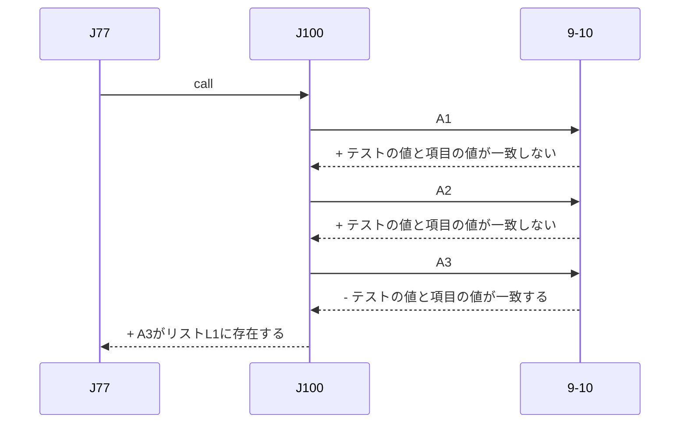

# CoroutineとGeneratorの実験

## 目的

このリポジトリはプログラミング言語におけるcoroutineとgeneratorの実験を行うための環境を提供する。
環境はDockerで構築して、ユーザーの環境を問わずに実験が行えることを目指す

## 実験環境

- 歴史的な価値のあるプログラミング言語
  - [ipl-v](legacy_sample/iplv)
  - [simula](legacy_sample/simula)
  - [clu](legacy_sample/clu)
  - [icon](legacy_sample/icon)
- 現在のプログラミング言語
  - [c++](simple_sample/cpp)
  - [c#](simple_sample/cs)
  - [node.js](simple_sample/node)
  - [php](simple_sample/php)
  - [python](simple_sample/python)
  - [ruby](simple_sample/rb)

## 歴史的メモ

### coroutine

多くのブログや書籍でcoroutineの概念はConwayが1958年に生み出したといわれます。

Conwayの[Design of a Separable Transition-Diagram Compiler](https://dl.acm.org/doi/10.1145/366663.366704)ではcoroutineを「特定のマスターがなく、同格の（コンパイルの処理を行う）サブルーチン同士が実行を譲り合いながら入出力をやり取りする自律的な処理単位」と説明しています。

同論文にcoroutineについて興味深い注釈があります。

>To the best of the author's knowledge the coroutine idea was concurrently developed by him and Joel Erdwinn, now of Computer Sciences Corporation. 

これはcoroutineというアイディアはJoel Drdwinnという人物にも同時期に考えられていたという記述です。
残念ながら、今現在、彼のアイディアがどういうものだったか現在確認するのは難しいですが、[Art of Computer Programming, The: Volume 1: Fundamental Algorithms, 3rd Edition](https://www.oreilly.com/library/view/art-of-computer/9780321635754/)から、その一片を窺い知ることができます。

> The word “coroutine” was coined by M. E. Conway in 1958, after he had developed the concept, and he first applied it to the construction of an assembly program. Coroutines were independently studied by J. Erdwinn and J. Merner, at about the same time; they wrote a paper entitled “Bilateral Linkage,” which was not then considered sufficiently interesting to merit publication, and unfortunately no copies of that paper seem to exist today. The first published explanation of the coroutine concept appeared much later in Conway’s article “Design of a Separable Transition-Diagram Compiler,” CACM 6 (1963), 396–408. Actually a primitive form of coroutine linkage had already been noted briefly as a “programming tip” in an early UNIVAC publication [The Programmer 1, 2 (February 1954), 4]. A suitable notation for coroutines in ALGOL-like languages was introduced in Dahl and Nygaard’s SIMULA I [CACM 9 (1966), 671–678], and several excellent examples of coroutines (including replicated coroutines) appear in the book Structured Programming by O.-J. Dahl, E. W. Dijkstra, and C. A. R. Hoare, Chapter 3.

*参考：（[Art of Computer Programming, The: Volume 1: Fundamental Algorithms, 3rd Edition](https://www.oreilly.com/library/view/art-of-computer/9780321635754/)の「1.4.5. History and Bibliography」）*

coroutineはJoel Drdwinnの“Bilateral Linkage,”という論文で執筆されたといわれるアイディアでしたが、残念なことに現存していません。
なお、UNIVACが出版した"The Programmer 1, 2 (February 1954), 4"の“programming tip”としてlinkage coroutinesというアイディアが簡潔に言及されていたとあります。ただ、これも2025年時点では、簡単に閲覧できるものではなさそうです。

さて、この後にcoroutineの概念を取り入れた高級プログラミング言語がいくつも登場しました。
1980年には[Coroutines : a programming methodology, a language design, and an implementation / by Christopher David Marlin](https://digital.library.adelaide.edu.au/items/787863ff-b666-4310-ab09-55b818b2b2a5)という論文が発表され、当時のプログラミングにおけるコルーチンの機構について整理がなされています。

- [Simula](https://en.wikipedia.org/wiki/Simula) 1962〜
  - ALGOL60を発展させたプログラミング言語
  - `resume`, `call`, `detach`で制御する
  - リポジトリに実験環境がある
- Gentleman
  - ANSI 標準 FORTRANの拡張
  - いくつかの論文に登場している
    - W.M. Gentleman, "Simplified Coroutine System – System Survey and User's Manual", (Simplified Coroutine System) Technical Note No. 3, Dept. of Applied Analysis and Computer Science, University of Waterloo, Waterloo, Ontario, Canada.
    - W.M. Gentleman, "Portable Coroutine System – The Translator", (Portable Coroutine System) Technical Note No.4, Dept. of Applied Analysis and Computer Science, University of Waterloo, Waterloo, Ontario, Canada.
    - W.M. Gentleman, "A Portable Coroutine System", Information Processing 71, C.V. Freiman (Ed.), pp.419–424 (North Holland Pub. Co., Amsterdam, 1972).
- Coroutine PASCAL
  - PascalにSimula型のコルーチンを加えたもの
  - いくつかの論文に登場している
    - M.J. Lemon, "Coroutine PASCAL: A Case Study in Separable Control", Technical Report No. 76-13, Dept. of Computer Science, University of Pittsburgh, Pittsburgh, Pennsylvania (December 1976).
    - M.J. Lemon, G. Lindstrom and M.L. Soffa, "Control Separation in Programming Languages", Proc. A.C.M. Annual Conference 1977, pp.496–501 (A.C.M., New York, 197
- 2-PAK
  - 人工知能向けに設計された言語
  - いくつかの論文に登場している
    - L.F. Melli, "The 2.PAK Language: Primitives for A.I. Applications", Technical Report No. 73, Department of Computer Science, University of Toronto, Toronto, Ontario, Canada (December 1974).
    - L.F. Melli, "The 2.PAK Language: Goals and Description", Proc. Fourth International Joint Conference on Artificial Intelligence (Tbilisi, U.S.S.R., September 1975), pp.549-555
- SL5
  - D.R. Hanson and R.E. Griswold, "[The SL5 Procedure Mechanism](https://dl.acm.org/doi/abs/10.1145/359488.359502)", Comm. A.C.M., Vol. 21, No. 5 (May 1978), pp. 392–400.
  - 後継に[Icon](https://en.wikipedia.org/wiki/Icon_(programming_language))がある
  - 後継のIconについては、このリポジトリで実験が可能
- Krieg
  - coroutineをcooperationsという単位にまとめる
  - B. Krieg, "A Class of Recursive Coroutines", Information Processing 74, J.L. Rosenfeld (Ed.), pp. 408–412 (North Holland Pub. Co., Amsterdam, 1974).
- Pritchard
  - 複数コルーチン系のための証明規則と“pool”の概念を提示
  - P.A. Pritchard, "A Proof Rule for Multiple Coroutine Systems", Information Processing Letters, Vol. 4, No. 6 (March 1976), pp. 141–143.
- Sajaniemi
  - コルーチンのグループ化でcogroups
  - J. Sajaniemi, "The Safety of a Coroutine System", Automata, Languages and Programming, A. Salomaa and M. Steinby (Eds.) (Lecture Notes in Computer Science, Vol. 52), pp. 440–452 (Springer-Verlag, Berlin, 1977).
- [Alphard](https://en.wikipedia.org/wiki/Alphard_(programming_language))
  - Pascal風のプログラミング言語。実際に実装はされていない
  - ジェネレータが採用されている
  - [Abstraction and verification in Alphard: defining and specifying iteration and generators](https://dl.acm.org/doi/10.1145/359763.359782)
- [CLU](https://en.wikipedia.org/wiki/CLU_(programming_language)) 1975〜
  - yieldによるイテレータ(ジェネレータ)を実装した初期の言語
  - Simula, Alpahard, Lispなどの影響をうけている
  - [A history of CLU](https://dl.acm.org/doi/10.1145/234286.1057826)
  - このリポジトリで実験が可能
- TELOS
  - Pascal を基にした AI 用プログラミング言語である
  - L. Travis, M. Honda, R. LeBlanc and S. Zeigler, "Design Rationale for TELOS, a Pascal-based A.I. Language", Proc. Symposium on Artificial Intelligence and Programming Languages (A.C.M. SIGPLAN Notices, Vol. 12, No. 8 (August 1977) and A.C.M. SIGART Newsletter, No. 64 (August 1977)), pp. 67–76.
  - R. J. LeBlanc, Jr., "Specifications and Rationale for TELOS, a Pascal-based Artificial Intelligence Programming Language", Computer Sciences Technical Report No. 309, Computer Sciences Department (also: Madison Academic Computing Center Technical Report No. 49), The University of Wisconsin, Madison, Wisconsin (December 1977).

また、この論文ではコルーチンという概念を整理し、「**generator**」という語は、**タスクを終えると呼び出し元（invoker）に戻るという制限をもつコルーチン**を指すようになったとも述べています。

### generator

さて、generatorの起源ですが、[Coroutines : a programming methodology, a language design, and an implementation / by Christopher David Marlin](https://digital.library.adelaide.edu.au/items/787863ff-b666-4310-ab09-55b818b2b2a5)において、以下のように述べられています。

>Probably the earliest published form of coroutines were the "generators" of Information Processing Language V (IPL-V), a symbol and list structure manipulation language described by Newell and Tonge

IPL-Vは1956年から登場した[Information Processing Language](https://en.wikipedia.org/wiki/Information_Processing_Language)の第5版です。
このプログラミング言語はアセンブリ言語のスタイルで書かれています。

List、そして今回のgeneratorを取り入れた初期のプログラミング言語になります。とくに[Lisp](https://www-formal.stanford.edu/jmc/history/lisp/node2.html)に影響を与えたといわれます。

**参考：**

- [An introduction to information processing language V](https://dl.acm.org/doi/10.1145/367177.367205)
- [INFORMATION PROCESSING LANGUAGE-V MANUAL](https://stacks.stanford.edu/file/druid:yz379pw9306/yz379pw9306.pdf)

では最古のgeneratorを確認してみましょう。  
以下はList中に指定のアイテムが存在するかを確認するための関数をJ100(ジェネレータ)で実装したものです。  

|NAME|PQ |SYMB |LINK |COMMENTS|
|:---|:--|:----|:----|:---|
|J77 |   |J50  |     |Put test symbol in WO.|
|    |10 |9-10 |     |9-10をH0 に入れる|
|    |   |J100 |     |Input name of subprocess;name of list already in HO.Execute generator.|
|    |   |J5   |J30  |Result is H5+ if looked at all symbols in vain; reverse sign.|
|9-10|11 |WO   |    |WO Subprocess: input test symbol.|
|    |   |J2   |J5  |Test; reverse sign to stop generator if find symbol.|

この関数はスタックのTOPに検査対象、次にListを積んでおいてから実行します。

|L1の内容|
|:---|
|A1|
|A2|
|A3|
|A4|

|スタック|説明|
|:---|:---|
|A3|Listに含まれるかどうかテストする値|
|L1|検査対象のList|

J100はリストの項目を1つづつ取り出してサブルーチン9-10に渡します。
サブルーチンで、その項目がテストする値と一致するか否かを判断します。
このループはリストの項目がテストの値と一致するか、リストの項目を全て使用するまで続きます。

IPL-Vが動作する実機は存在しませんが、幸運なことにLispでIPL-Vをエミュレートするツールが提供されており、本リポジトリでは、それをDocker環境上でためすことができます。